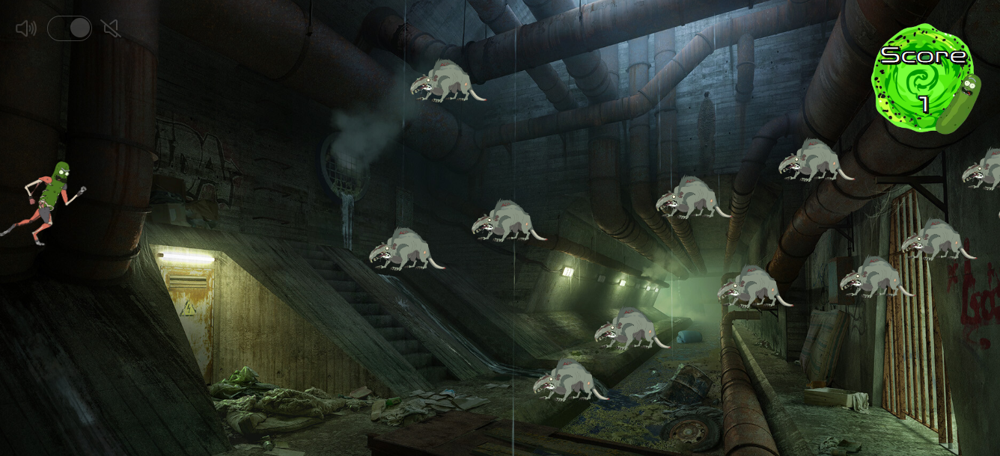

#Pickle Rick vs Rats: the Game#

##Description##
I developed this game as my first project during a web development program at Ironhack.
The idea is to deliver a shooting game using **HTML, CSS & Javascript**.
To make it more fun and attractive, I chose a popular theme, *Rick & Morty*.

 

##Instructions to play##
The game has 3 keypad commands:
- *"Arrow Up"* to move up,
- *"Arrow Down"* to move down,
- *"Space bar"* to shoot.

NB: a sound toggle switch is available on the top-left of the game board.

##Demo##
Try it yourself at (https://thomasaugot.github.io/game-pickle-rick-vs-rats/)